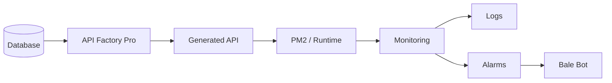
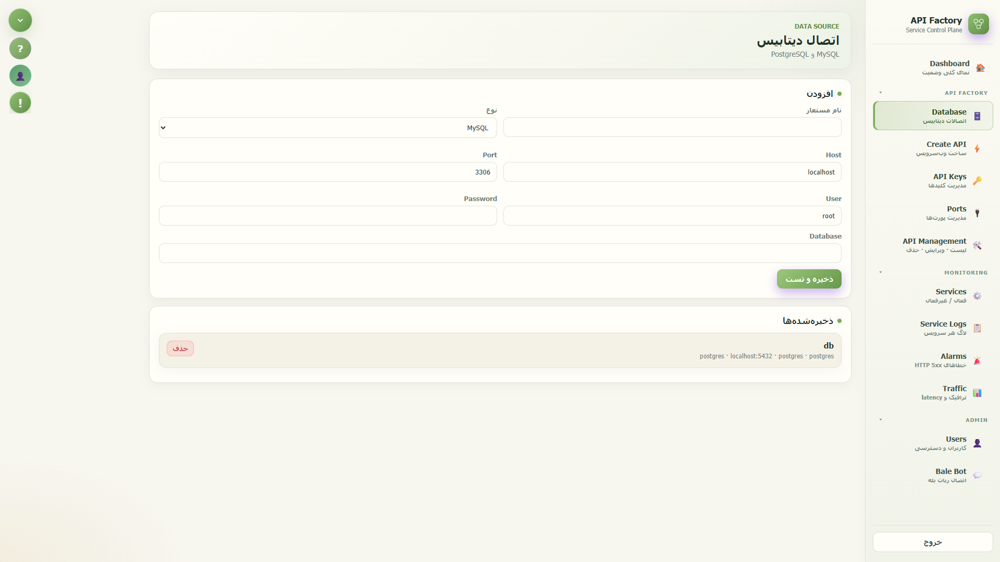
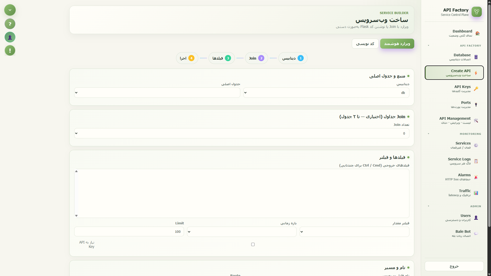
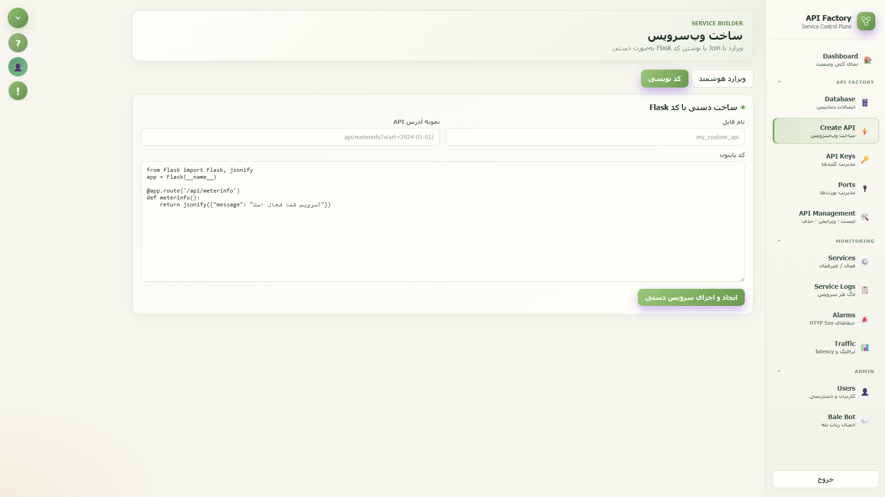
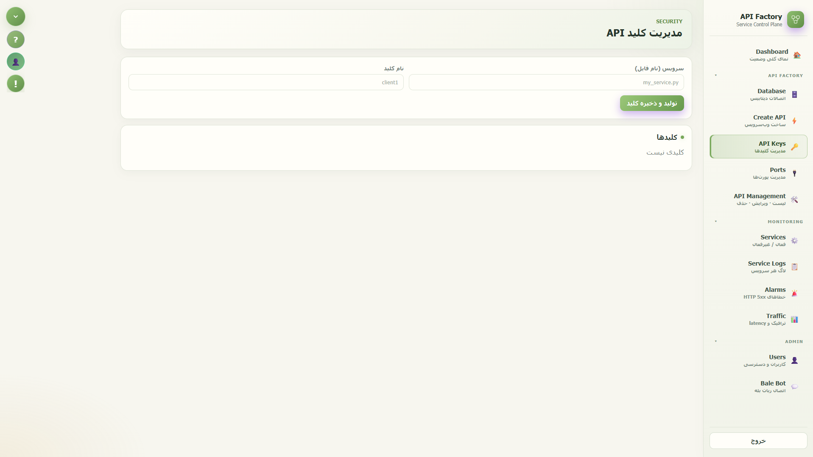
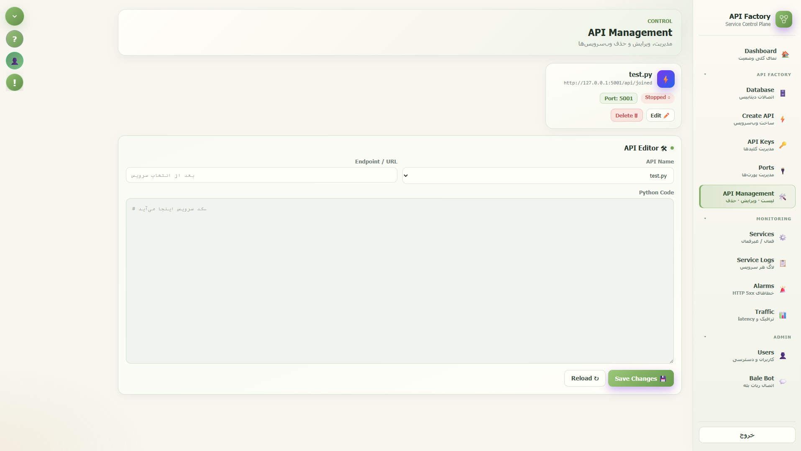
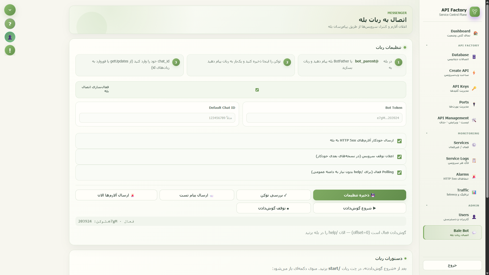

# ⚡ API Factory Pro

> **Build. Secure. Monitor. Control.**

یک پنل مدیریتی سبک، مدرن و یکپارچه برای **ساخت، مدیریت، اجرا، مانیتورینگ و کنترل Web Serviceها**.

> **From Database to API — From API to Monitoring.**

 به‌جای پراکنده‌کردن فرآیند ساخت API بین کدنویسی، تنظیم Port، اجرای Process، مدیریت API Key، بررسی Log و Monitoring، این چرخه را در یک **Service Control Plane** متمرکز می‌کند.

---

## ✨ چرا API Factory Pro؟

```text
Database
   ↓
Write Python Code
   ↓
Configure API
   ↓
Choose Port
   ↓
Run Process
   ↓
Monitor Service
   ↓
Read Logs
   ↓
Detect Errors
   ↓
Manage Access
   ↓
Notify Administrator
```



---

## 🚀 قابلیت‌های اصلی

| قابلیت | توضیح |
|---|---|
| 🗄️ Database | اتصال و مدیریت MySQL و PostgreSQL |
| ⚡ Create API | ساخت سریع API از روی Database |
| 🧙 Wizard | ساخت API بدون نیاز به نوشتن کامل Backend |
| 👨‍💻 کد نویسی | ساخت API با Python/Flask |
| 🔌 Ports | مشاهده و مدیریت Portهای سرویس‌ها |
| 🔑 API Keys | مدیریت دسترسی APIها |
| 🛠️ API Management | کنترل Lifecycle سرویس‌ها |
| 📋 Logs | مشاهده Log سرویس‌ها |
| 🚨 Alarms | تشخیص خطاهای HTTP 5xx |
| 📊 Traffic | مشاهده وضعیت مصرف و عملکرد API |
| 👤 Users | مدیریت کاربران و دسترسی‌ها |
| 💬 Bale Bot | Notification و Monitoring از طریق بله |
| 📈 Dashboard | مشاهده وضعیت کلی سیستم |
| 🔐 Authentication | احراز هویت و Session Management |
| 📱 Responsive UI | رابط کاربری مناسب برای اندازه‌های مختلف صفحه |

---


# 🗄️ Database


بخش Database محل تعریف و مدیریت Connectionهای دیتابیس است.

API Factory در حال حاضر از:

MySQL
PostgreSQL

پشتیبانی می‌کند.

پس از ذخیره، Connection برای استفاده در API Builder در دسترس قرار می‌گیرد.

# ⚡ Create API

یکی از مهم‌ترین بخش‌های API Factory.

این بخش دو روش اصلی برای ساخت سرویس در اختیار کاربر قرار می‌دهد:

1. 🧙 Wizard



برای کاربرانی که می‌خواهند بدون نوشتن کامل Backend، یک API مبتنی بر Database ایجاد کنند.

** می‌توان از چند جدول دیتابیس یک API ساخت:

Customers --> (table-1 join table-2)
     
و خروجی را به شکل یک Endpoint در اختیار سایر سیستم‌ها قرار داد.


2. 👨‍💻 کد نویسی



برای Developerهایی که کنترل کامل روی API را می‌خواهند.

در این حالت کاربر مستقیماً کد Python/Flask سرویس را وارد می‌کند.

این حالت برای APIهای پیچیده‌تر، Logicهای اختصاصی، محاسبات سفارشی و Integrationهای خاص مناسب است.

# 🔑 API Keys



بخش API Keys برای کنترل دسترسی سرویس‌ها طراحی شده است.

برای هر Service می‌توان یک یا چند API Key تعریف کرد.

این ساختار اجازه می‌دهد مصرف‌کنندگان مختلف یک API با Credentialهای جداگانه کار کنند.

# 🔌 Ports

هر سرویس برای اجرا به یک پورت نیاز دارد.

این بخش محیطی متمرکز برای مشاهده و مدیریت پورت های مرتبط با وب سرویس ها فراهم می‌کند.

در این قسمت می‌توان وضعیت پورت ها را مشاهده کرد:

Port-
Status-
PID-
Process-
Service

همچنین محدوده پورت های آزاد وب سرویس ها نیز نمایش داده می‌شود.

این موضوع در محیط‌هایی که تعداد زیادی API داخلی روی یک Server اجرا می‌شوند اهمیت زیادی دارد.

# 🛠️ API Management



این بخش مرکز مدیریت Web Serviceهای ساخته‌شده است.

همچنین عملیات مدیریتی اصلی در اختیار Administrator قرار دارد:
Delete
Edit
View Code
API Editor

یکی از قابلیت‌های کاربردی این بخش، ویرایش مستقیم Source Code سرویس است.

Administrator می‌تواند:

Select Service
      ↓
Load Python Code
      ↓
Edit
      ↓
Save Changes

را مستقیماً از داخل پنل انجام دهد.

# ⚙️ Services

بخش Services نمای Runtime سرویس‌هاست.

این قسمت با PM2 ارتباط دارد و امکان کنترل Lifecycle سرویس‌ها را فراهم می‌کند.

عملیات اصلی:

▶️ Start
⏹️ Stop
🗑️ Delete
📄 مشاهده Code
📋 مشاهده Logs

به این ترتیب Administrator برای عملیات روزمره الزاماً نیازی به ورود مستقیم به Shell Server ندارد.

# 📋 Service Logs

دیباگ کردن یک وب سرویس بدون لاگ ها تقریباً غیرممکن است.

این برنامه  امکان مشاهده لاگ سرویس‌ها را از داخل پنل فراهم می‌کند.

به‌جای:

pm2 logs service_name

ادمین میتواند مستقیما تمام لاگ ها را در محیط گرافیکی مشاهده کند

# 🚨 Alarms

این برنامه  می‌تواند HTTP Server Errorهای واقعی را شناسایی کند.

تمرکز این بخش روی خطاهای:

HTTP 5xx

است.

این بخش یک لایه ساده اما کاربردی برای تشخیص سریع سرویس‌های مشکل‌دار ایجاد می‌کند.

# 📊 Traffic

بخش Traffic برای مشاهده رفتار سرویس‌ها طراحی شده است.

اطلاعاتی مانند:

Request Count
Endpoint
HTTP Status
Response Time
Response Size
Timestamp

قابل بررسی هستند.

این اطلاعات کمک می‌کنند Administrator متوجه شود:

کدام API بیشتر استفاده می‌شود؟

کدام سرویس Latency بیشتری دارد؟

چه Endpointهایی بیشتر خطا می‌دهند؟

چه زمانی ترافیک افزایش پیدا کرده است؟

# 👤 Users

این برنامه  فقط برای یک ادمین ساخته نشده است.

بخش Users امکان تعریف کاربران مختلف را فراهم می‌کند.

برای هر User می‌توان مواردی مانند:

Username
Password
Role
Permissions

را مشخص کرد.

# 💬 Bale Bot



یکی از قابلیت‌های متفاوت API Factory، اتصال آن به پیام‌رسان بله است.

هدف این بخش این است که Administrator فقط به Dashboard وابسته نباشد و بتواند بخشی از وضعیت سیستم را از طریق Messenger دریافت یا کنترل کند.

امکانات Bale Bot
🔐 Bot Configuration

امکان تعریف:

Bot Token
Default Chat ID
Enable / Disable
Alarm Notifications
Service Down Notifications
Polling

وجود دارد.

# 🎯 چه کسانی از API Factory Pro سود می‌برند؟

این برنامه برای هر پروژه‌ای ساخته نشده است؛ بیشترین ارزش آن در محیط‌هایی است که تعداد قابل توجهی سرویس داخلی وجود دارد.

# 🏢 سازمان‌ها و شرکت‌ها

برای سازمان‌هایی که چندین سیستم داخلی دارند و نیاز دارند:

Database → API → Monitoring

را در یک محیط متمرکز مدیریت کنند.

# 🧑‍💻 Data Engineerها

برای Data Engineerهایی که مرتباً باید از دیتابیس‌های سازمانی API بسازند.

# 🧠 Data Scientistها

برای Data Scientistهایی که نیاز دارند خروجی مدل یا Dataset خود را به‌صورت API در اختیار سایر سیستم‌ها قرار دهند.

به‌جای اینکه هر بار یک Backend کامل ساخته شود:

Model / Query
     ↓
API Factory
     ↓
REST API


# اجرا
پیشنهاد می‌شود محیط اجرا حداقل شامل موارد زیر باشد:

Python 3.10+
PM2
MySQL and/or PostgreSQL
Linux Server
Install
git clone <YOUR_REPOSITORY_URL>
cd api_factory

سپس:

pip install -r requirements.txt
Run
uvicorn app:app --host 0.0.0.0 --port 8501

سپس پنل از طریق:

http://SERVER_IP:8501

در دسترس خواهد بود.

